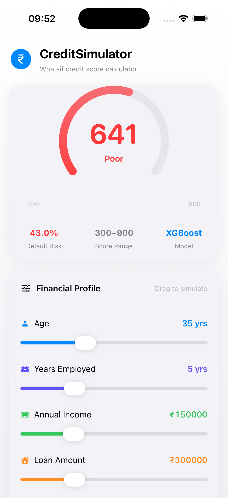
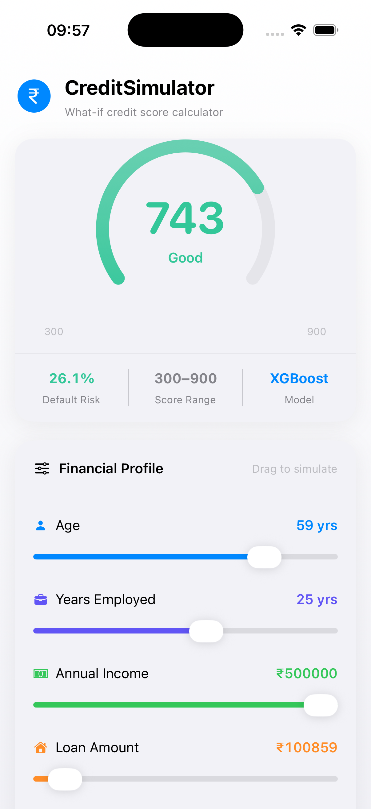

# CreditSimulator


A FinTech "what-if" credit scoring simulator built on 307,511 real loan applications.
Move the sliders → see your predicted credit score update in real time.

---

## Live Demo

**API:** https://creditsimulator.onrender.com

**iOS App:** See [`/ios`](./ios/CreditSimulator/) — SwiftUI, runs on iOS 17+

> First API request may take ~30s as the Render instance is cold (free tier).

---

## Screenshots

| Default Values | Adjusted Profile |
|---|---|
|  |  |

---

## Architecture

```
User (iOS sliders)
        ↓
SwiftUI App — CreditViewModel (MVVM, 400ms debounce)
        ↓  HTTP POST /predict
FastAPI Backend (Render, Python 3.11)
        ↓
XGBoost Model (trained on Home Credit dataset)
        ↓
{ credit_score: 742, risk_tier: "Good", default_prob: 0.26 }
```

---

## Model

| Property | Value |
|---|---|
| Algorithm | XGBoostClassifier |
| Dataset | Home Credit Default Risk (Kaggle) |
| Training samples | 246,008 |
| Test samples | 61,503 |
| ROC-AUC | 0.6789 (baseline: 0.5063) |

**Features used:** Age, Years Employed, Annual Income, Loan Amount, Loan Annuity, Children count. Ratio features (Credit/Income, Annuity/Income, Credit Term) are derived server-side — not exposed to the user.

**Score mapping:** `credit_score = int(900 - (default_probability × 600))`
This is a linear transform for demo clarity. Real credit bureaus use PDO (Points to Double the Odds) log-odds calibration. The linear approximation is an intentional simplification.

**Disclaimer:** This is a portfolio/demonstration project. Not a production credit scoring system. Do not use for real lending decisions.

---

## API Endpoints

### `GET /`
Health check.

### `GET /metadata`
Returns model version, AUC, hyperparameters, features, score mapping rationale, and disclaimer. Loaded from `model_metadata.json` — single source of truth for all model info.

### `POST /predict`
Rate limited to 30 requests/minute per IP.

```json
{
  "age_years": 35,
  "years_employed": 5,
  "amt_income_total": 150000,
  "amt_credit": 300000,
  "amt_annuity": 15000,
  "cnt_children": 1
}
```

Returns:

```json
{
  "credit_score": 673,
  "risk_tier": "Fair",
  "default_prob": 0.3777
}
```

Risk tiers: **Excellent** (750+) / **Good** (700+) / **Fair** (650+) / **Poor** (600+) / **Very Poor** (<600)

---

## Tech Stack

| Layer | Technology |
|---|---|
| ML Model | XGBoost, Scikit-learn, Pandas |
| Backend | FastAPI, Python 3.11, pydantic-settings |
| Rate Limiting | slowapi (30 req/min per IP) |
| Deployment | Render |
| CI | GitHub Actions (pytest, 22 tests) |
| iOS App | SwiftUI, MVVM, Combine |

---

## Project Structure

```
CreditSimulator/
├── .github/
│   └── workflows/
│       └── ci.yml                # GitHub Actions — runs pytest on every push
├── backend/
│   ├── api/
│   │   └── index.py              # FastAPI app — /predict, /metadata, logging, rate limiting
│   ├── model/
│   │   ├── model_xgb.pkl         # Trained XGBoost model (~415KB)
│   │   ├── train_medians.json    # Imputation values saved from training split
│   │   ├── model_metadata.json   # Model version, AUC, hyperparameters
│   │   └── train_model.py        # Training script (argparse, no data leakage)
│   ├── tests/
│   │   ├── test_api.py           # 13 API tests (health, predict, validation errors)
│   │   └── test_model.py         # 9 model tests (artifacts, predictions, edge cases)
│   ├── config.py                 # pydantic-settings — env-based config
│   ├── .env.example              # Environment variable template
│   ├── requirements.txt
│   └── Procfile                  # Render start command
└── ios/
    └── CreditSimulator/
        ├── AppConfig.swift        # Backend URL + timeout config
        ├── Models.swift           # CreditInput/Output + display helpers
        ├── APIService.swift       # async/await URLSession, typed errors
        ├── CreditViewModel.swift  # MVVM state, debounce, race condition fix
        └── ContentView.swift      # SwiftUI views, accessibility labels
```

---

## Backend Engineering Notes

- **Structured logging** — every request and response logged to stdout with timestamp and level. Visible in Render's Logs tab for production debugging.
- **Rate limiting** — `slowapi` at 30 req/minute per IP. Configurable via `RATE_LIMIT` environment variable.
- **Environment config** — all settings (paths, rate limit, log level, CORS) loaded via `pydantic-settings`. Override in production without code changes.
- **Model versioning** — `model_metadata.json` tracks version, training date, AUC, and hyperparameters. Surfaced at `/metadata`.
- **PII awareness** — only age, income, and credit amount are logged. Full input combinations are not logged to reduce fingerprinting risk.

---

## iOS Architecture Notes

- **MVVM** — `CreditViewModel` owns all state and API logic. Views are pure UI.
- **400ms debounce** — waits for the user to stop dragging before firing a request.
- **Race condition fix** — in-flight tasks are cancelled before new ones start.
- **Age clamp** — `yearsEmployed` is automatically capped to `age - 16` to prevent 422 validation errors.
- **Cold-start UX** — a hint appears after 4s of loading so users know the server is waking up.

See [`ios/CreditSimulator/README.md`](./ios/CreditSimulator/README.md) for full design decision notes.

---
